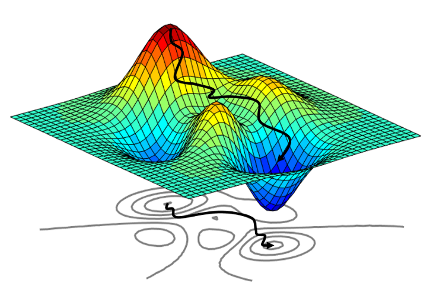

# Curso: Tópicos selectos de matemáticas (Optimización)

## Semestre
> Agosto-Diciembre 2023

## Impartido por:
<ul>
  <li> Dr. Jesús Emmanuel Solís Pérez </li>
  <li> Email: jsolisp@unam.mx </li>
</ul>

## Página personal del profesor
> [https://sites.google.com/view/je-solis-perez](https://sites.google.com/view/je-solis-perez)

## Prerequisitos
<ol>
 <li>Cálculo I y II </li>
</ol>

## Software requerido y herramientas
<ol>
 <li>Python & Jupyter Notebook </li>
 <li>Sistema operativo: Windows 10, Linux, o macOS</li>
 <li>Web Browser: Google Chrome, Opera o Firefox.</li>
 <li>Markdown para escribir documentación.</li>
 <li>Sistema de control de versiones.</li>
</ol>

## Contenido del curso

| **Unidad** | **Tema** | **Contenido** | **Material** |
|:---:|:---:|:---|:---:|
| I | Introducción a la optimización | <li>Formalismo matemático.</li> <li>Funciones convexas.</li> <li>Tipos de problemas.</li> | <ol><li>[Código(Colab)](codes/.ipynb)</li> <li>[Código(Colab)](codes/.ipynb)</li> <li>[Código(Colab)](codes/.ipynb)</li> </ol> |
| II | Fundamentos de optimización sin restricciones | <li>Caracterización de un mínimo.</li> <li>Tipo de algoritmos de optimización.</li> | <ol><li>[Código(Colab)](codes/.ipynb)</li> <li>[Código(Colab)](codes/JESP_10_Gradiente_descendente.ipynb)</li> </ol> |
| III | Optimización sin restricciones | <li>Método de Búsqueda en Línea.</li> <li>Método de Región de Confianza.</li> <li>Método de Gradiente Conjugado.</li> <li>Método de Quasi-Newton.</li> <li>Método de Gradiente Descendente.</li> | <ol><li>[Código(Colab)](codes/JESP_06_Busqueda_lineal.ipynb)</li> <li>[Código(Colab)](codes/JESP_07_Region_confianza.ipynb)</li> <li>[Código(Colab)](codes/JESP_08_Gradiente_conjugado.ipynb)</li> <li>[Código(Colab)](codes/JESP_09_Quasi_Newton.ipynb)</li> <li>[Código(Colab)](codes/.ipynb)</li> </ol> |
| IV | Optimización con restricciones | <li>Programación lineal</li> <li>Programación cuadrática </li> <li>Métodos de penalización y Lagrangiano aumentado </li> | <ol><li>[Código(Colab)](codes/.ipynb)</li> <li>[Código(Colab)](codes/.ipynb)</li> <li>[Código(Colab)](codes/.ipynb)</li> </ol> |
| V | Algoritmos heurísticos | <li>Basados en trayectorias (SA).</li> <li>Basados en métodos constructivos (GRASP, ACO).</li> <li>Basados en Poblaciones (GA, PSO).</li> <li>Optimización multi-objetivo.</li> | <ol><li>[Código(Colab)](codes/.ipynb)</li><li>[Código(Colab)](codes/.ipynb)</li><li>[Código(Colab)](codes/.ipynb)</li><li>[Código(Colab)](codes/.ipynb)</li> </ol> |

## Libros de apoyo
<ol>
 <li> Numerical Optimization, 2nd Edition. Jorge Nocedal, Stephen Wright. </li>
 <li> Iterative Methods for Optimization, 1st Edition. C.T. Kelley. </li>
 <li> An Introduction to Metaheuristics for Optimization, 2018 Edition. Bastien Chopard, Marco Tomassini. </li>
 <li> Estimation of Distribution Algorithms: A New Tool for Evolutionary Computation: 2. Pedro Larrañaga, José a Lozano. </li>
</ol>

##### Última modificación 8 de octubre de 2022
